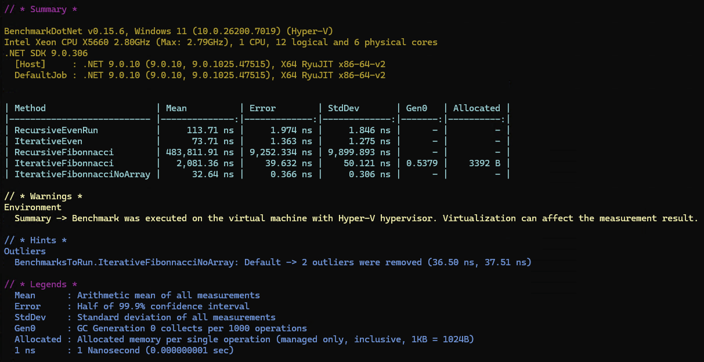

# Övning 4 - Datastrukturer och minne i C#

I denna projekt vi kollar på olika datastrukturer i C# och hur de påverkar minne. Vi kommer att jämföra prestanda och minnesanvändning mellan olika typer av 
samlingar som listor, arrayer och dictionaries.

## Innehåll

### Obligatoriska uppgifter
1. **Examinera listan**: Kolla på listans prestanda vid insättning och borttagningelement.  
2. **Examinera Queue**: Kolla på köens prestanda vid insättning och borttagning av element.  
3. **Examinera Stack**: Kolla på stackens prestanda vid insättning och borttagning av element.  
4. **Checkparenthesis**: Implementera en funktion som kontrollerar om parenteser och andraa symboler i en sträng är balanserade med hjälp av en stack.
5. **ReverseText**: Implementera en funktion som vänder på en sträng med hjälp av en stack.

### Extra uppgifter
6. **UseRecursiveEven**: Implementera en rekursiv funktion som beräknar n:te jämnt element.
7. **FibonacciSequence**: Implementera en rekursiv funktion som visas Fibonnacci sekvence upp till angivna nummber.
8. **IterativeEven**: Implementera en iterativ funktion som beräknar n:te jämnt element.
9. **IterativeFibonacci**: Implementera en iterativ funktion som visas Fibonnacci sekvence upp till angivna nummber.


### Exekvera Programmet

För att köra programmet, följ dessa steg:
```bash
	dotnet run SkalProj_DtaStrukturer_Minne
```

### Benchmark
Det finns en benchmark projekt inkluderad i lösningen som mäter prestanda för olika datastrukturer och algoritmer. För att köra benchmarken, följ dessa steg:
```bash
	dotnet run DataStrukturerMinneBenchmark
```



## Ansvarar på frågorna:

- **När ökar listans kapacitet?** => När Count == Capacity och vi lägger till ett nytt element.
- **Med hur mycket ökar listans kapacitet?** => Den dubblas.
- **Varför ökar inte listans kapacitet på samma takt som element läggs till?**
=> Jag tror listan tar en fixat antal på minnet och ställar en ny fixat antal när Capacity måste ökar.
- **Minskar kapacitet när vi elementen tas bort från listan?** => Nej. Kapacitet minska inte även om vi tomtar listan.
- **När är det då fördelaktigt att använda en egendefinierad array istället för en lista?** 				
=> När vi vill kontrollera när Capacity ska öka eller minska, eller vi vet att listan kommer ändras i stolek på en stor sätt dynamiskt.
- **Vaför är det inte smart att använda en stack i det här fallet?** => första kund som stör i köan skulle bli arg, och kanske kommer aldrig blir expedierad.
- **Vilken datastruktur användar du?** => Stack - FILO lista :) för att det är perfekt för att hantera ordret av symboler.

- Utgå ifrån era nyvunna kunskapper om iterationb, rekursion och minneshantering. Vilken av ovanstående funktioner är mest minnesvänligt och varför? 
=> Iterative funktioner är mest minnesvänligt eftersom de inte skapar nya stack frames för varje anrop, vilket minskar minnesanvändningen jämfört med rekursiva funktioner.  
Därför är iteraativa funktioner också oftast snabbare än rekursiva funktioner, eftersom de undviker overheaden av funktionsanrop och stackhantering.

Även iteraktiv funktion med en Array blev snabbare än rekursiv funktion, som visas i benchmark resultatet (bild).
